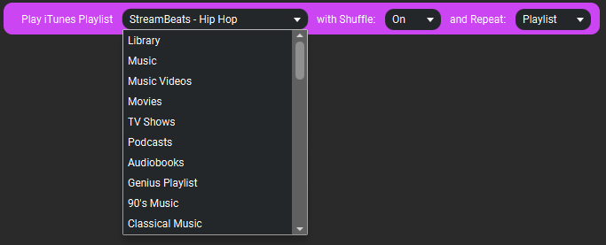
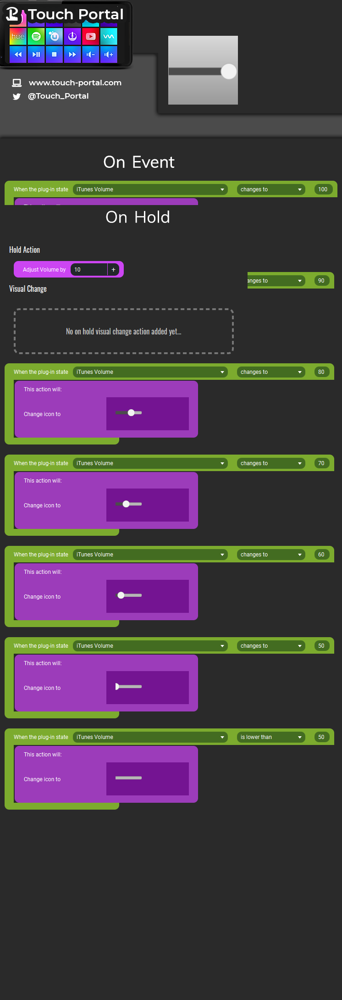
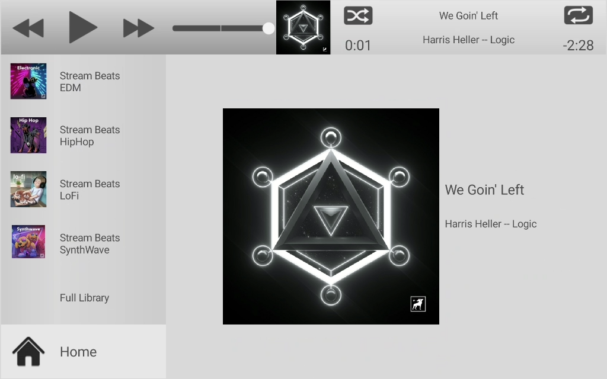

# TouchPortal Plugin to Control ITunes

- [TouchPortal Plugin to Control ITunes](#touchportal-plugin-to-control-itunes)
  - [Notes/Warnings](#noteswarnings)
  - [Setup](#setup)
  - [Configuration](#configuration)
  - [Actions](#actions)
  - [Events](#events)
    - [Examples](#examples)
      - [Set the Current Track Album Artwork to Button Icon](#set-the-current-track-album-artwork-to-button-icon)
      - [Shuffle w/ Time Played](#shuffle-w-time-played)
      - [Volume Up - with Image Changes](#volume-up---with-image-changes)
  - [States](#states)
  - [Example Pages](#example-pages)
    - [iTunes Player Clone](#itunes-player-clone)
    - [iTunes Mini Player Clone](#itunes-mini-player-clone)
  - [Icons](#icons)
  - [Get iTunes Playlist Images](#get-itunes-playlist-images)
  - [Dependencies](#dependencies)
  - [Versioning](#versioning)
  - [Authors](#authors)
  - [License](#license)
  - [Bugs/Enhancements](#bugsenhancements)
  - [Acknowledgments](#acknowledgments)

## Notes/Warnings
```
1️⃣ This has only been tested on Windows 10 64-bit, with latest version of iTunes from Microsoft Store
2️⃣ There is no guarantee it will work elsewhere
3️⃣ Apple could make their COM Interface obsolete at any point with an update, so no guarantees this works forever
```
## Setup
1. Download the TPiTunes.tpp file from [here](https://github.com/spdermn02/TouchPortal_ITunes_Plugin/raw/master/resources/TPiTunes.tpp)
1. Import the Plug-in into Touch Portal 
    
    

1. Click "Ok" on the window that pops up

    

1. If this is your first time loading the plug-in then click "Trust Always"

    

1. The plugin should be started now and you should be able to interface to iTunes from Touch Portal - Woohoo!!! (of course, iTunes has to be OPEN to do that)

## Configuration
Depending on your age of your Touch Portal install your configuration file is in 

*%APPDATA%\TouchPortal\plugins\TPiTunes*

 or in 
 
*%UserProfile%\Documents\TouchPortal\plugins\TPiTunes*

*config.json* is the configuration file, it is in JSON format
```javascript
//  "Off" turns the selected item off - must restart plugin
{
  "artwork": "On", // "On" = if you want Artwork of Current Playing Track sent to Touch Portal, "Off" turns this off - must restart plugin
  "timers": "On"  // "On" = if you want current play time/time left streamed to Touch Portal every second (turning this off will help not fill your log.txt with a bunch of info but you lose this functionality)
}
```

## Actions

This plug-in offers the following Actions:


* Play/Pause Toggle - does what it says, plays music if paused/stopped, pauses music if playing
* \>\> Next Track - skips to the next track of playlist
* << Back Track - skips to beginning of current song, or previous track depending on how much of current track has played
* Shuffle - Toggles Shuffle between Off or On
* Repeat - Toggles Repat between Off, Repeat Song, Repeat Playlist
* Volume Up + 10 - Adds 10 to the current volume control IN iTunes (not system)
* Volume Down - 10 - Subtracts 10 from the current volume control IN iTunes (not system)
* Play iTunes Playlist - allows selection of a playlist to Play, if shuffle should be on or off, and if repeat should be Off/Song/Playlist



## Events
There are no events directly tied to this plugin. You will be using the built in "When plug-in state changes" event to determine when states are updated from the plugin back to Touch Portal.

### Examples

Here are a few examples, this is not the full list of what you have access to, just examples

#### Set the Current Track Album Artwork to Button Icon


#### Shuffle w/ Time Played


#### Volume Up - with Image Changes


## States
Here are the states that the TPiTunes Plug-in has:


## Example Pages
### iTunes Player Clone
Download [iTunesFull Page](resources/iTunesFull.tpz)


### iTunes Mini Player Clone
Download: [iTunesMini Page](resources/iTunesMini.tpz)


## Icons
Download [iTunes Icons](reousrces/iTunesIcons.tpi)


## Get iTunes Playlist Images

1. Follow this picture in iTunes

2. Open up web browser, and paste the copied link

3. Save the image
4. Go To TouchPortal and add the image as an icon to your button

## Dependencies
- [touchportal-api](https://www.npmjs.com/package/touchportal-api)
- [winax](https://www.npmjs.com/package/winax)
- [remove-accents](https://www.npmjs.com/package/remove-accents)

## Versioning

We use [SemVer](http://semver.org/) for versioning. For the versions available, see the [tags on this repository](https://github.com/spdermn02/tpohm_plugin/tags).

## Authors

- **Jameson Allen** - _Initial work_ - [Spdermn02](https://github.com/spdermn02)

## License

This project is licensed under the GNU General Public License v3.0 - see the [LICENSE](LICENSE) file for details

## Bugs/Enhancements
Use the Github Issues tab to report any bugs/enhancements for this plug-in. Or mention them in the Touch Portal discord channel #TPiTunes

## Acknowledgments

- Thank you to Josh Kunz for documenting the iTunes COM interface [http://www.joshkunz.com/iTunesControl/main.html](http://www.joshkunz.com/iTunesControl/main.html)
- Thank you to Ty and Reinier for creating and developing Touch Portal