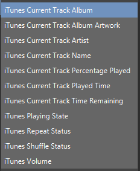
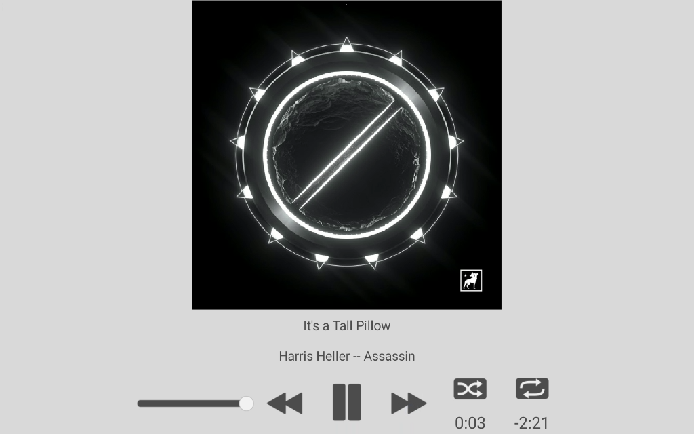

# TouchPortal Plugin to Control ITunes

- [TouchPortal Plugin to Control ITunes](#touchportal-plugin-to-control-itunes)
  - [Notes/Warnings](#noteswarnings)
  - [Change Log](#change-log)
    - [3.0.3](#303)
    - [3.0.2](#302)
    - [3.0.1](#301)
    - [3.0.0](#300)
    - [2.0.1](#201)
    - [2.0.0](#200)
  - [Setup](#setup)
  - [Configuration](#configuration)
  - [Actions](#actions)
  - [Events](#events)
  - [Examples](#examples)
    - [Set the Current Track Album Artwork to Button Icon](#set-the-current-track-album-artwork-to-button-icon)
    - [Shuffle w/ Time Played](#shuffle-w-time-played)
    - [Volume Up - with Image Changes - Shows On Hold Functionality](#volume-up---with-image-changes---shows-on-hold-functionality)
    - [Volume Slider](#volume-slider)
  - [States](#states)
  - [Example Pages](#example-pages)
    - [iTunes Player](#itunes-player)
    - [iTunes Mini Player Clone](#itunes-mini-player-clone)
  - [Icons](#icons)
  - [Get iTunes Playlist Images](#get-itunes-playlist-images)
  - [Dependencies](#dependencies)
  - [Versioning](#versioning)
  - [Authors](#authors)
  - [License](#license)
  - [Bugs/Enhancements](#bugsenhancements)
  - [Acknowledgments](#acknowledgments)

## Notes/Warnings
```
1️⃣ This has only been tested on Windows 10 64-bit, with latest version of iTunes from Microsoft Store
2️⃣ There is no guarantee it will work elsewhere
3️⃣ Apple could make their COM Interface obsolete at any point with an update, so no guarantees this works forever
```

## Change Log
### 3.0.3
* Bug Fix
  * Fixed TP Performance Warning Alert

### 3.0.2
* Added
  * State to hold the percentage played of the current track

### 3.0.1
* Bug Fixes
  * [#3](https://github.com/spdermn02/TouchPortal_ITunes_Plugin/issues/3) - Fixed this bug so now the plugin doesn't crash playing things outside of your library
  * Fixed issue with local missing artwork on a file not causing plugin to crash, instead an empty album art will be sent back (when setting is on to enable artwork)
  
### 3.0.0
* Added
  * Slider Action for Volume - syncs with application
  * on Play/Pause all states are updated including Album Art
  * on Page Change in Touch Portal, broadcast event forces all states to update back to Touch Portal
* Updated
  * Upgraded to touchportal-api 3.0.0
* Examples
  * Updated example Pages with slider control instead of image based volume control
  * Added downloadable slider button for volume by itself
* Hint
  * If you want raw single digit volume, change the Volume Round By setting to 1
  
### 2.0.1
* Bug Fix
  * Fixed Volume adjust to recognize being in On Press section of Button
  
### 2.0.0
* Updated
  * TouchPortal-API v2.0.1 update
  * Updated Sample Images and Pages with all the new actions
  * Changed Action Color to fit better with iTunes coloring
* Added
  * Single Volume Adjustment with OnHold capabilities
* Deprecated
  * Individual Volume Changes - This action was removed from being able to be added, but is still supported
    * Will be removed in a future version
* Bug Fixes
  * UTF-8 was added in TPv2.3 and the TouchPortal-API v2.0.1 update so special characters in playlists will not break anymore
  


## Setup
1. Download the TPiTunes.tpp file from [here](https://github.com/spdermn02/TouchPortal_ITunes_Plugin/releases/latest)
1. Import the Plug-in into Touch Portal 
    
    

1. Click "Ok" on the window that pops up

    

1. If this is your first time loading the plug-in then click "Trust Always"

    

1. The plugin should be started now and you should be able to interface to iTunes from Touch Portal - Woohoo!!! (of course, iTunes has to be OPEN to do that)

## Configuration
Configuration now is done inside of Touch Portal<br>


* Volume Round By: the value you want to round to for use in displaying slider position (recommend 10) - if you want the single digit value - change to 1
* Display Artwork: "On" or "Off" - If you don't plan on displaying the currently playing artwork, turn this Off
* Track Timers: "On" or "Off" - If you don't plan on displaying the current play time and remaining time, turn this Off

If you would like to customize your empty album art to be something unique for you, just replace the file in %APPDATA%\TouchPortal\plugins\TPiTunes called empty_album_art.jpg (just use a 256x256 size image for best results). Future release will allow for automatic lookup of the album artwork from the Apple Music Web API, and only use this if nothing can be found there.

## Actions

This plug-in offers the following Actions:


* Play/Pause Toggle - does what it says, plays music if paused/stopped, pauses music if playing
* \>\> Next Track - skips to the next track of playlist
* << Back Track - skips to beginning of current song, or previous track depending on how much of current track has played
* Shuffle - Toggles Shuffle between Off or On
* Repeat - Toggles Repat between Off, Repeat Song, Repeat Playlist
* iTunes Adjust Volume - Adjust iTunes Volume up or down by your defined amount (not system)
  * Usable in the "On Hold" tab, to adjust your volume by holding down the button - Note: it can adjust very quickly, so beware.
* *Deprecated* - Volume Up + 10 - Adds 10 to the current volume control IN iTunes (not system)
* *Deprecated* - Volume Down - 10 - Subtracts 10 from the current volume control IN iTunes (not system)
* Play iTunes Playlist - allows selection of a playlist to Play, if shuffle should be on or off, and if repeat should be Off/Song/Playlist

_Deprecated_: This action will still work with this version, but may be removed in future versions.  This is no longer an Addable action, but your existing buttons will still work.


## Events
There are no events directly tied to this plugin. You will be using the built in "When plug-in state changes" event to determine when states are updated from the plugin back to Touch Portal.

## Examples

Here are a few examples, this is not the full list of what you have access to, just examples

### Set the Current Track Album Artwork to Button Icon


### Shuffle w/ Time Played


### Volume Up - with Image Changes - Shows On Hold Functionality
**Note**: There is a bug in the image, that will be fixed when Touch Portal fixes their side.<br>


### Volume Slider
New to Touch Portal 3.0.0 is Sliders, and the iTunes Plugin supports the Volume now as a slider control
Designed with iTunes styling.


Download [TP Volume Slider](resources/iTunes-Volume-Sideways-Slider.tpb)

## States
Here are the states that the TPiTunes Plug-in has:




## Example Pages
### iTunes Player
3.0.0 Updated with Slider
Download [iTunesFull Page](resources/TPiTunes-Full-3.0.0Update.tpz)


### iTunes Mini Player Clone
3.0.0 Updated with Slider
Download: [iTunesMini Page](resources/TPiTunes-Mini-3.0.0Update.tpz)


## Icons
Download [iTunes Icons](reousrces/iTunesIcons.tpi)


## Get iTunes Playlist Images

1. Follow this picture in iTunes

2. Open up web browser, and paste the copied link

3. Save the image
4. Go To TouchPortal and add the image as an icon to your button

## Dependencies
- [touchportal-api](https://www.npmjs.com/package/touchportal-api)
- [winax](https://www.npmjs.com/package/winax)

## Versioning

We use [SemVer](http://semver.org/) for versioning. For the versions available, see the [tags on this repository](https://github.com/spdermn02/tpohm_plugin/tags).

## Authors

- **Jameson Allen** - _Initial work_ - [Spdermn02](https://github.com/spdermn02)

## License

This project is licensed under the GNU General Public License v3.0 - see the [LICENSE](LICENSE) file for details

## Bugs/Enhancements
Use the Github Issues tab to report any bugs/enhancements for this plug-in. Or mention them in the Touch Portal discord channel #TPiTunes

## Acknowledgments

- Thank you to Josh Kunz for documenting the iTunes COM interface [http://www.joshkunz.com/iTunesControl/main.html](http://www.joshkunz.com/iTunesControl/main.html)
- Thank you to Ty and Reinier for creating and developing Touch Portal
